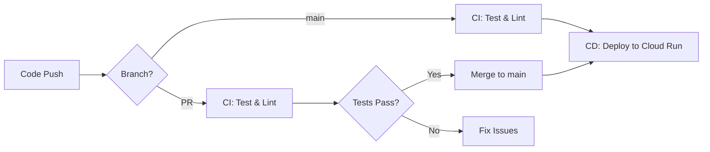

# CI/CD ガイド

このドキュメントでは、WithGames Discord Bot の CI/CD パイプラインについて説明します。

## 目次

1. [概要](#概要)
2. [CI - テストとリント](#ci---テストとリント)
3. [CD - Cloud Runへのデプロイ](#cd---cloud-runへのデプロイ)
4. [セットアップ](#セットアップ)
5. [ワークフローのトリガー](#ワークフローのトリガー)
6. [シークレットの設定](#シークレットの設定)
7. [トラブルシューティング](#トラブルシューティング)

## 概要

GitHub Actions を使用した CI/CD パイプラインで、コードの品質保証と自動デプロイを実現しています。

### CI/CDフロー



### ワークフロー構成

- **CI (Continuous Integration)**: `.github/workflows/ci.yml`
  - コード品質チェック
  - 自動テスト実行
  - セキュリティスキャン

- **CD (Continuous Deployment)**: `.github/workflows/deploy.yml`
  - Dockerイメージビルド
  - Artifact Registryへのプッシュ
  - Cloud Runへの自動デプロイ

## CI - テストとリント

### トリガー

- Pull Request作成時
- `main` ブランチへのプッシュ時

### ジョブ

#### 1. Test and Lint

```yaml
- Ruff によるコードリント
- Ruff によるフォーマットチェック
- Pyright による型チェック
- Pytest によるテスト実行
- カバレッジレポート生成
```

**実行時間**: 約2-3分

#### 2. Security Check

```yaml
- Safety による依存関係の脆弱性チェック
- Bandit によるセキュリティリンター
```

**実行時間**: 約1-2分

### ローカルでのCIチェック

デプロイ前にローカルで同じチェックを実行できます:

```bash
# リント
uv run ruff check .

# フォーマットチェック
uv run ruff format --check .

# 型チェック
uv run pyright

# テスト
uv run pytest tests/ -v

# カバレッジ付きテスト
uv run pytest tests/ --cov=src --cov-report=html

# セキュリティチェック
uv run safety check
uv run bandit -r src/ -ll
```

## CD - Cloud Runへのデプロイ

### トリガー

- `main` ブランチへのプッシュ
- `v*` タグのプッシュ（例: `v1.0.0`）
- 手動実行（workflow_dispatch）

### デプロイフロー

1. **コードチェックアウト**
2. **GCP認証** - Workload Identity を使用
3. **Dockerイメージビルド** - Buildx によるマルチプラットフォームビルド
4. **Artifact Registryへプッシュ**
5. **Cloud Runへデプロイ**
6. **デプロイ検証** - ログ確認と動作確認
7. **サマリー生成** - デプロイ結果をGitHub上に表示

### イメージタグ戦略

- **タグプッシュ時**: タグ名を使用（例: `v1.0.0`）
- **mainプッシュ時**: Git commit hash を使用（例: `abc1234`）
- **常に**: `latest` タグも同時に更新

```bash
# タグベースのデプロイ例
git tag v1.0.0
git push origin v1.0.0
# → Image: xxx.pkg.dev/project/repo/service:v1.0.0
```

## セットアップ

### 1. GCP Workload Identity の設定

GitHub ActionsがGCPに安全に認証するため、Workload Identityを設定します。

```bash
# プロジェクトIDを設定
export PROJECT_ID="your-project-id"
export PROJECT_NUMBER=$(gcloud projects describe $PROJECT_ID --format="value(projectNumber)")
export GITHUB_REPO="your-github-username/your-repo-name"

# Workload Identity Poolの作成
gcloud iam workload-identity-pools create "github-actions-pool" \
  --project="${PROJECT_ID}" \
  --location="global" \
  --display-name="GitHub Actions Pool"

# Workload Identity Pool Providerの作成
gcloud iam workload-identity-pools providers create-oidc "github-actions-provider" \
  --project="${PROJECT_ID}" \
  --location="global" \
  --workload-identity-pool="github-actions-pool" \
  --display-name="GitHub Actions Provider" \
  --attribute-mapping="google.subject=assertion.sub,attribute.actor=assertion.actor,attribute.repository=assertion.repository" \
  --issuer-uri="https://token.actions.githubusercontent.com"

# サービスアカウントの作成（まだの場合）
gcloud iam service-accounts create github-actions-sa \
  --display-name="GitHub Actions Service Account"

# 必要な権限を付与
gcloud projects add-iam-policy-binding $PROJECT_ID \
  --member="serviceAccount:github-actions-sa@${PROJECT_ID}.iam.gserviceaccount.com" \
  --role="roles/run.admin"

gcloud projects add-iam-policy-binding $PROJECT_ID \
  --member="serviceAccount:github-actions-sa@${PROJECT_ID}.iam.gserviceaccount.com" \
  --role="roles/artifactregistry.writer"

gcloud projects add-iam-policy-binding $PROJECT_ID \
  --member="serviceAccount:github-actions-sa@${PROJECT_ID}.iam.gserviceaccount.com" \
  --role="roles/iam.serviceAccountUser"

# Workload IdentityとGitHub Actionsの紐付け
gcloud iam service-accounts add-iam-policy-binding \
  "github-actions-sa@${PROJECT_ID}.iam.gserviceaccount.com" \
  --project="${PROJECT_ID}" \
  --role="roles/iam.workloadIdentityUser" \
  --member="principalSet://iam.googleapis.com/projects/${PROJECT_NUMBER}/locations/global/workloadIdentityPools/github-actions-pool/attribute.repository/${GITHUB_REPO}"

# Workload Identity Providerの完全名を取得
gcloud iam workload-identity-pools providers describe "github-actions-provider" \
  --project="${PROJECT_ID}" \
  --location="global" \
  --workload-identity-pool="github-actions-pool" \
  --format="value(name)"
```

### 2. GitHub Secretsの設定

GitHubリポジトリの Settings > Secrets and variables > Actions で以下を設定:

| Secret名 | 値 | 説明 |
|---------|-----|------|
| `GCP_PROJECT_ID` | your-project-id | GCPプロジェクトID |
| `GCP_WORKLOAD_IDENTITY_PROVIDER` | projects/123456789/locations/global/workloadIdentityPools/github-actions-pool/providers/github-actions-provider | Workload Identity Providerの完全名 |
| `GCP_SERVICE_ACCOUNT` | github-actions-sa@your-project-id.iam.gserviceaccount.com | サービスアカウントのメールアドレス |
| `CODECOV_TOKEN` | (オプション) | Codecovトークン（カバレッジレポート用） |

### 3. GCP Secret Managerの設定

Bot用のシークレットが設定されていることを確認:

```bash
# Discord Bot Tokenの確認
gcloud secrets describe discord-bot-token --project=$PROJECT_ID

# Discord Application IDの確認
gcloud secrets describe discord-app-id --project=$PROJECT_ID
```

設定されていない場合は、[GCPセットアップガイド](./GCP_SETUP.md)を参照してください。

## ワークフローのトリガー

### 自動トリガー

#### Pull Request

```bash
# 1. 新しいブランチを作成
git checkout -b feature/new-feature

# 2. コードを変更してコミット
git add .
git commit -m "Add new feature"

# 3. プッシュ
git push origin feature/new-feature

# 4. GitHubでPull Requestを作成
# → CI ワークフローが自動実行される
```

#### Main ブランチへのマージ

```bash
# Pull Requestをマージ
# → CI と CD の両方が実行される
```

#### タグによるリリース

```bash
# 1. タグを作成
git tag -a v1.0.0 -m "Release v1.0.0"

# 2. タグをプッシュ
git push origin v1.0.0

# → CD ワークフローが実行され、v1.0.0 としてデプロイ
```

### 手動トリガー

GitHub Actionsのページから手動で実行できます:

1. GitHub リポジトリの **Actions** タブに移動
2. **CD - Deploy to Cloud Run** ワークフローを選択
3. **Run workflow** をクリック
4. ブランチを選択して **Run workflow**

## シークレットの設定

### GitHub Secrets

```bash
# GitHubのWebUIで設定するか、GitHub CLIを使用
gh secret set GCP_PROJECT_ID --body "your-project-id"
gh secret set GCP_WORKLOAD_IDENTITY_PROVIDER --body "projects/.../providers/github-actions-provider"
gh secret set GCP_SERVICE_ACCOUNT --body "github-actions-sa@your-project-id.iam.gserviceaccount.com"
```

### GCP Secret Manager

```bash
# Discord Bot Tokenを更新
echo -n "new-discord-token" | gcloud secrets versions add discord-bot-token --data-file=-

# シークレットのバージョンを確認
gcloud secrets versions list discord-bot-token
```

## トラブルシューティング

### CI が失敗する

#### テストが失敗する

```bash
# ローカルでテストを実行
uv run pytest tests/ -v

# 特定のテストのみ実行
uv run pytest tests/test_specific.py -v

# デバッグモードで実行
uv run pytest tests/ -vv --log-cli-level=DEBUG
```

#### リンターエラー

```bash
# リンターを実行
uv run ruff check .

# 自動修正
uv run ruff check --fix .

# フォーマット
uv run ruff format .
```

#### 型エラー

```bash
# 型チェック
uv run pyright

# 特定のファイルのみチェック
uv run pyright src/cogs/event_manager.py
```

### CD が失敗する

#### 認証エラー

```
Error: Failed to authenticate with Google Cloud
```

**解決方法**:
1. Workload Identity が正しく設定されているか確認
2. GitHub Secrets が正しく設定されているか確認
3. サービスアカウントに必要な権限があるか確認

```bash
# サービスアカウントの権限を確認
gcloud projects get-iam-policy $PROJECT_ID \
  --flatten="bindings[].members" \
  --filter="bindings.members:serviceAccount:github-actions-sa@${PROJECT_ID}.iam.gserviceaccount.com"
```

#### イメージプッシュエラー

```
Error: Failed to push image to Artifact Registry
```

**解決方法**:
1. Artifact Registry が有効化されているか確認
2. リポジトリが存在するか確認
3. サービスアカウントに `artifactregistry.writer` 権限があるか確認

```bash
# リポジトリを確認
gcloud artifacts repositories list --location=$REGION

# 権限を確認
gcloud artifacts repositories get-iam-policy $REPO_NAME --location=$REGION
```

#### デプロイエラー

```
Error: Failed to deploy to Cloud Run
```

**解決方法**:
1. Cloud Run APIが有効化されているか確認
2. サービスアカウントに `run.admin` 権限があるか確認
3. Secret Managerのシークレットが存在するか確認

```bash
# Cloud Run サービスを確認
gcloud run services list --region=$REGION

# シークレットを確認
gcloud secrets list
```

### ログの確認

#### GitHub Actions ログ

1. **Actions** タブに移動
2. 失敗したワークフローをクリック
3. 失敗したジョブをクリック
4. エラーメッセージを確認

#### Cloud Run ログ

```bash
# 最新のログを確認
gcloud run logs read withgames-bot --region=asia-northeast1 --limit=50

# エラーログのみ
gcloud run logs read withgames-bot \
  --region=asia-northeast1 \
  --log-filter="severity>=ERROR"

# リアルタイムログ
gcloud run logs tail withgames-bot --region=asia-northeast1
```

## ベストプラクティス

### 1. ブランチ戦略

```
main (保護ブランチ)
  ↑
  └── develop (開発用)
       ↑
       └── feature/xxx (機能開発)
```

- `main`: 本番環境、保護ブランチ
- `develop`: 開発環境（オプション）
- `feature/*`: 機能開発用ブランチ

### 2. コミットメッセージ

```bash
# 良い例
git commit -m "feat: Add event closing notification"
git commit -m "fix: Resolve waitlist promotion bug"
git commit -m "docs: Update deployment guide"

# タイプ
feat: 新機能
fix: バグ修正
docs: ドキュメント
refactor: リファクタリング
test: テスト追加
chore: その他の変更
```

### 3. Pull Request

- **小さく、頻繁に**: 大きなPRは避ける
- **明確なタイトル**: 何をしたのか一目でわかるように
- **説明を追加**: 変更理由や影響範囲を記載
- **レビューを依頼**: 最低1人のレビューを得る

### 4. デプロイ戦略

```bash
# 段階的デプロイ（カナリアデプロイ）
# 1. 新バージョンをデプロイ
./scripts/deploy.sh

# 2. 一部のトラフィックを新バージョンに
gcloud run services update-traffic withgames-bot \
  --to-revisions=withgames-bot-00010-abc=10,withgames-bot-00009-xyz=90 \
  --region=asia-northeast1

# 3. 問題なければ段階的に増やす
gcloud run services update-traffic withgames-bot \
  --to-latest \
  --region=asia-northeast1
```

### 5. ロールバック

```bash
# 前のリビジョンに戻す
gcloud run revisions list --service=withgames-bot --region=asia-northeast1
gcloud run services update-traffic withgames-bot \
  --to-revisions=withgames-bot-00009-xyz=100 \
  --region=asia-northeast1
```

## まとめ

- **CI**: コードの品質を自動チェック
- **CD**: `main` ブランチへのマージで自動デプロイ
- **Workload Identity**: セキュアな認証
- **段階的デプロイ**: リスクを最小化
- **ロールバック**: 問題発生時に即座に復旧

詳細は以下のドキュメントも参照してください:
- [デプロイガイド](./DEPLOYMENT.md)
- [GCPセットアップ](./GCP_SETUP.md)
- [ローカルセットアップ](./SETUP.md)
